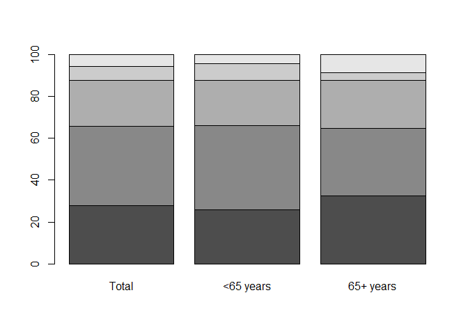
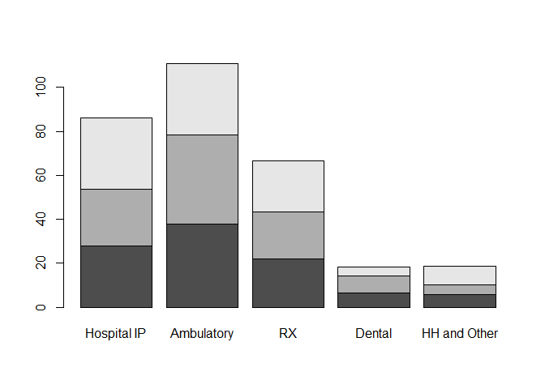
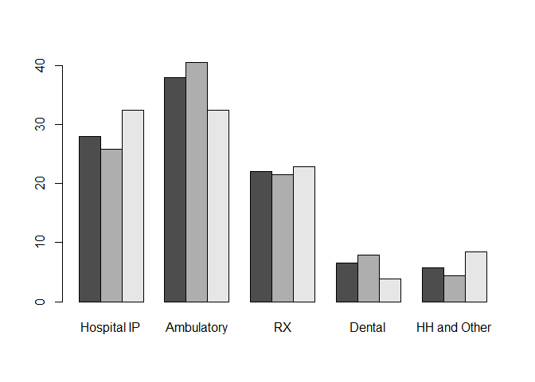
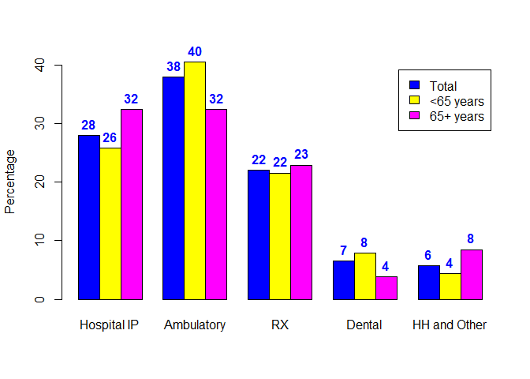
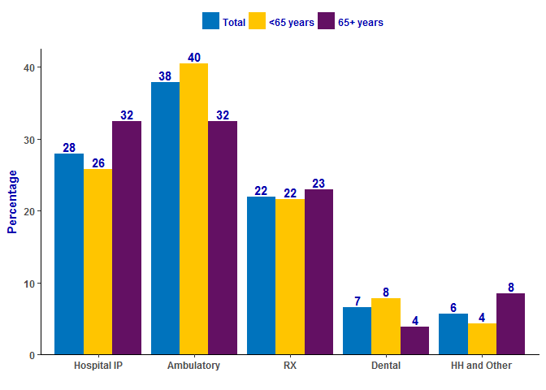

Analyzing MEPS data using R
================
Emily Mitchell
October 26, 2016

LOADING MEPS DATA
-----------------

To load MEPS data, we will use the **foreign** package, which allows R to read SAS transport files. The **install.packages** function only needs to be run once (to download the package from the internet and store it on your computer). The **library** function needs to be run every time you re-start your R session.

``` r
 install.packages("foreign")  # Only need to run this once
```

``` r
 library(foreign)             # Run this every time you re-start R
```

Option 1. Download SAS transport file to computer
=================================================

1.  Download and extract the SAS transport format zip file into 'C:/MEPS/SASDATA'


1.  Use **read.xport** function to load file

``` r
FYC2013 = read.xport("C:/MEPS/SASDATA/h163.ssp")
```

Option 2. Load data directly from website
=========================================

1.  Use **download.file** function to save zip file from MEPS website to temporary file **temp** (Hint: get file location by right-clicking ZIP link on website, then click 'Copy link address')
2.  Use **unzip** and **read.xport** to unzip and load SAS transport data.

``` r
download.file("https://meps.ahrq.gov/mepsweb/data_files/pufs/h163ssp.zip",
              temp <- tempfile())
    
unzipped_file = unzip(temp)

FYC2013 = read.xport(unzipped_file)
    
unlink(temp) # Unlink to delete temporary file
```

SURVEY PACKAGE
--------------

Install and load **survey** package
===================================

``` r
  install.packages("survey")
```

``` r
  library(survey)
```

Functions available in **survey** package

-   *svytotal*: population totals
-   *svymean*: proportions and means
-   *svyquantile*: quantiles (e.g. median)
-   *svyratio*: ratio statistics (e.g. percentage of total expenditures)
-   *svyglm*: generalized linear regression
-   *svyby*: run other survey functions by group

Define survey design object
===========================

``` r
mepsdsgn = svydesign(id = ~VARPSU, 
                     strata = ~VARSTR, 
                     weights = ~PERWT13F, 
                     data = FYC2013, 
                     nest=TRUE)  
```

EXPENSES PER PERSON, BY SOURCE OF PAYMENT [(TABLE 1)](https://meps.ahrq.gov/mepsweb/data_stats/tables_compendia_hh_interactive.jsp?_SERVICE=MEPSSocket0&_PROGRAM=MEPSPGM.TC.SAS&File=HCFY2013&Table=HCFY2013_PLEXP_%40&VAR1=AGE&VAR2=SEX&VAR3=RACETH5C&VAR4=INSURCOV&VAR5=POVCAT13&VAR6=REGION&VAR7=HEALTH&VARO1=4+17+44+64&VARO2=1&VARO3=1&VARO4=1&VARO5=1&VARO6=1&VARO7=1&_Debug=):
-------------------------------------------------------------------------------------------------------------------------------------------------------------------------------------------------------------------------------------------------------------------------------------------------------------------------------------------------------------------------------------

Total population
================

Total population = sum of survey weights (PERWT13F). We don't need to use a **svy** function here, since standard errors are not applicable to population control totals.

``` r
sum(FYC2013$PERWT13F) 
```

    ## [1] 315721982

Total expenses
==============

To use the **svytotal** function, we can use the '$' notation to indicate that we want to use dataset FYC2013 and variable TOTEXP13.

``` r
svytotal(FYC2013$TOTEXP13, design = mepsdsgn)  
```

    ##           total         SE
    ## [1,] 1.4005e+12 4.3378e+10

Or we can use the formula notation '~', to tell R that we want to look in the design object **mepsdsgn** (in which we defined dataset FYC2013) to find the variable TOTEXP13.

``` r
svytotal(~TOTEXP13,design = mepsdsgn)  
```

    ##               total         SE
    ## TOTEXP13 1.4005e+12 4.3378e+10

Percent with expense
====================

To calculate the percent of people with any expense, first create a new indicator variable for persons with an expense.

``` r
FYC2013$any_expense = (FYC2013$TOTEXP13 > 0)*1

head(FYC2013$any_expense) 
```

    ## [1] 1 0 1 1 0 0

But, when we try to run **svymean**, we get an error, since we added a variable to the dataset *after* defining the survey design object, **mepsdsgn**.

``` r
svymean(~any_expense, design = mepsdsgn) 
```

    ## Error in eval(expr, envir, enclos): object 'any_expense' not found

We need to re-run the code defining **mepsdsgn** to include the dataset with the new variable.

``` r
mepsdsgn = svydesign(id = ~VARPSU, 
                     strata = ~VARSTR, 
                     weights = ~PERWT13F, 
                     data = FYC2013, 
                     nest=TRUE)
```

Now **svymean** will work, since the **mepsdsgn** object now includes the version of the dataset that contains the new variable **any\_expense**

``` r
svymean(~any_expense,design = mepsdsgn) 
```

    ##                mean     SE
    ## any_expense 0.84398 0.0036

Mean and median, per person with an expense
===========================================

To get expenses per person with an expense, we want to limit the dataset to persons that have an expense (i.e. any\_expense == 1), using the **subset** function.

``` r
#mean
svymean(~TOTEXP13, design = subset(mepsdsgn,any_expense==1)) 
```

    ##          mean     SE
    ## TOTEXP13 5256 118.17

``` r
#median
svyquantile(~TOTEXP13, design = subset(mepsdsgn,any_expense==1),quantiles = 0.5) 
```

    ##           0.5
    ## TOTEXP13 1389

Distribution of expenses by source of payment
=============================================

For percent of total, we need to use the **svyratio** function, and specify the numerator and denominator. First, we'll estimate the percent for out-of-pocket payments (TOTSLF13).

``` r
svyratio(~TOTSLF13, denominator = ~TOTEXP13, design = mepsdsgn)
```

    ## Ratio estimator: svyratio.survey.design2(~TOTSLF13, denominator = ~TOTEXP13, design = mepsdsgn)
    ## Ratios=
    ##           TOTEXP13
    ## TOTSLF13 0.1377617
    ## SEs=
    ##             TOTEXP13
    ## TOTSLF13 0.004395095

We can also calculate percentages for multiple variables at one time, using a '+' sign in the formula notation.

``` r
svyratio(~TOTSLF13 + TOTPTR13 + TOTMCR13 + TOTMCD13, 
    denominator = ~TOTEXP13, 
    design = mepsdsgn)
```

    ## Ratio estimator: svyratio.survey.design2(~TOTSLF13 + TOTPTR13 + TOTMCR13 + TOTMCD13, 
    ##     denominator = ~TOTEXP13, design = mepsdsgn)
    ## Ratios=
    ##           TOTEXP13
    ## TOTSLF13 0.1377617
    ## TOTPTR13 0.4060437
    ## TOTMCR13 0.2530722
    ## TOTMCD13 0.1243487
    ## SEs=
    ##             TOTEXP13
    ## TOTSLF13 0.004395095
    ## TOTPTR13 0.011466596
    ## TOTMCR13 0.009134258
    ## TOTMCD13 0.007487569

Before estimating percentages for 'Other' insurance, we need to adjust this variable to match the online table: Other = VA + worker's comp + other sources.

Previously, we did this by adding new variables to the dataset FYC2013, and then re-defining the design object **mepsdsgn**. But, we can streamline this process by using the **update** function to make changes to **mepsdsgn** directly, without changing the dataset FYC2013.

``` r
mepsdsgn <- update(mepsdsgn, tototh13 = TOTVA13 + TOTWCP13 + TOTOTH13)
```

``` r
svyratio(~tototh13, denominator = ~TOTEXP13, design = mepsdsgn)
```

    ## Ratio estimator: svyratio.survey.design2(~tototh13, denominator = ~TOTEXP13, design = mepsdsgn)
    ## Ratios=
    ##            TOTEXP13
    ## tototh13 0.07877691
    ## SEs=
    ##             TOTEXP13
    ## tototh13 0.005148356

PERCENTAGE DISTRIBUTION BY TYPE OF SERVICE [(STAT BRIEF \#491)](https://meps.ahrq.gov/data_files/publications/st491/stat491.shtml)
----------------------------------------------------------------------------------------------------------------------------------

Now we will re-create the data table for Figure 1 in Stat brief \#491: "National Health Care Expenses in the U.S. Civilian Noninstitutionalized Population, Distributions by Type of Service and Source of Payment, 2013" by Marie Stagnitti.

To get ambulatory (OB+OP) and home health/other expenditures, we need to add variables to the **mepsdsgn** object.

``` r
  mepsdsgn <- update(mepsdsgn, 
                     ambexp13 = OBVEXP13 + OPTEXP13 + ERTEXP13,
                     hhexp13  = HHAEXP13 + HHNEXP13 + VISEXP13 + OTHEXP13)
```

Up until now, we've been running survey functions to estimate means, totals, etc., but we've only been printing that information to the R console, rather than storing those estimates.

Here, we create the variable **pct\_TOS** to store the estimates from the **svyratio** function, which is calculating the percentage distribution of expenditures by type of service.

``` r
pct_TOS = svyratio(~IPTEXP13 + ambexp13 + RXEXP13 + DVTEXP13 + hhexp13, 
                     denominator = ~TOTEXP13, 
                     design = mepsdsgn)
```

Because we are storing estimates in the variable **pct\_TOS**, we have to ask R to specifically print the results if we want to view them.

``` r
print(pct_TOS)
```

    ## Ratio estimator: svyratio.survey.design2(~IPTEXP13 + ambexp13 + RXEXP13 + DVTEXP13 + 
    ##     hhexp13, denominator = ~TOTEXP13, design = mepsdsgn)
    ## Ratios=
    ##            TOTEXP13
    ## IPTEXP13 0.27911022
    ## ambexp13 0.37882294
    ## RXEXP13  0.21977145
    ## DVTEXP13 0.06556864
    ## hhexp13  0.05672677
    ## SEs=
    ##             TOTEXP13
    ## IPTEXP13 0.011717046
    ## ambexp13 0.008278700
    ## RXEXP13  0.007218369
    ## DVTEXP13 0.002462953
    ## hhexp13  0.003511954

Now we can do the same thing by age group (&lt; 65, and 65+), using the **subset** function.

``` r
pct_TOS_lt65 = svyratio(~IPTEXP13 + ambexp13 + RXEXP13 + DVTEXP13 + hhexp13, 
                        denominator = ~TOTEXP13, 
                        design = subset(mepsdsgn,AGELAST < 65))
  
pct_TOS_ge65 = svyratio(~IPTEXP13 + ambexp13 + RXEXP13 + DVTEXP13 + hhexp13, 
                        denominator = ~TOTEXP13, 
                        design = subset(mepsdsgn,AGELAST >= 65))
```

Now we want to extract the coefficient estimates and combine them into a table. To do that, we can use the function **coef** to get the coefficients from the **svyratio** results, and then combine them into a matrix using **cbind**.

``` r
pct_matrix = cbind(coef(pct_TOS),
                   coef(pct_TOS_lt65),
                   coef(pct_TOS_ge65))*100
print(pct_matrix)
```

    ##                        [,1]      [,2]      [,3]
    ## IPTEXP13/TOTEXP13 27.911022 25.795551 32.383667
    ## ambexp13/TOTEXP13 37.882294 40.464733 32.422359
    ## RXEXP13/TOTEXP13  21.977145 21.540182 22.900994
    ## DVTEXP13/TOTEXP13  6.556864  7.848380  3.826269
    ## hhexp13/TOTEXP13   5.672677  4.351155  8.466711

To clean it up a bit, we can change the row and column names:

``` r
rownames(pct_matrix) = c("Hospital IP",
                        "Ambulatory",
                        "RX",
                        "Dental",
                        "HH and Other")
 
colnames(pct_matrix) = c("Total","<65 years","65+ years")
  
print(pct_matrix)
```

    ##                  Total <65 years 65+ years
    ## Hospital IP  27.911022 25.795551 32.383667
    ## Ambulatory   37.882294 40.464733 32.422359
    ## RX           21.977145 21.540182 22.900994
    ## Dental        6.556864  7.848380  3.826269
    ## HH and Other  5.672677  4.351155  8.466711

Export table to Excel (csv file)
================================

If we are happy with our table, now we can export it to a .csv file, to make a barchart in excel.

``` r
write.csv(pct_matrix,file = "C:/MEPS/figure1.csv")
```

Create a barplot in R
=====================

Alternatively, we can make a bar chart in R instead!

The default for the function **barplot** is to create a stacked bar plot if we give it a matrix, where each bar represents a column.

``` r
  barplot(pct_matrix) 
```



In order to switch the bar chart, so that the bars are type of service, not age group, we can use the transpose function **t** to pivot the matrix

``` r
print(t(pct_matrix))
```

    ##           Hospital IP Ambulatory       RX   Dental HH and Other
    ## Total        27.91102   37.88229 21.97714 6.556864     5.672677
    ## <65 years    25.79555   40.46473 21.54018 7.848380     4.351155
    ## 65+ years    32.38367   32.42236 22.90099 3.826269     8.466711

``` r
barplot(t(pct_matrix)) 
```



To change the bars to be side by side, use the 'beside = TRUE' option

``` r
barplot(t(pct_matrix), beside = TRUE) 
```



We can also specify colors for the pars, add a label to the y-axis, add a legend, and add data labels on top of the bars.

``` r
bp <- barplot(t(pct_matrix),beside=TRUE,
                col = c("blue","yellow","magenta"),
                ylab = "Percentage",
                legend=T)

text(x = bp, y = t(pct_matrix)+2,
     labels = round(t(pct_matrix)),
     xpd=T,col="blue",font=2)
```



Saving your data
----------------

We've done all of this hard work to load in the MEPS files and calculate estimates, so how can we save it to use next time?

We can just save a single item, for instance, the MEPS FYC 2013 data

``` r
save(FYC2013,file = "C:/MEPS/SASDATA/PUF_h163.RData")
```

Or we can save multiple items, like **pct\_matrix** and the **mepsdsgn** object.

``` r
save(mepsdsgn,pct_matrix,file = "C:/MEPS/SASDATA/PUF_and_table.RData")
```

Once the .Rdata file is saved, it can be re-loaded in a new R session using the following code:

``` r
load(file = "C:/MEPS/SASDATA/PUF_h163.RData")
```

BONUS MATERIAL
--------------

svyby
=====

The **svyby** function can be used to calculate estimates for all levels of a subgroup. For instance, previously we calculated the percent distribution of expenditures by type of service separately for persons aged 65 and older and those under age 65, by using the **subset** function.

``` r
svyratio(~IPTEXP13+ambexp13, 
              denominator = ~TOTEXP13, 
              design = subset(mepsdsgn,AGELAST >= 65))
```

    ## Ratio estimator: svyratio.survey.design2(~IPTEXP13 + ambexp13, denominator = ~TOTEXP13, 
    ##     design = subset(mepsdsgn, AGELAST >= 65))
    ## Ratios=
    ##           TOTEXP13
    ## IPTEXP13 0.3238367
    ## ambexp13 0.3242236
    ## SEs=
    ##            TOTEXP13
    ## IPTEXP13 0.01611175
    ## ambexp13 0.01221816

However, we can also get estimates for persons 65+ and &lt;65 simulataneously by using the **svyby** function. This function works with other svy functions (e.g. **svymean**, **svytotal**, **svyratio**) using the **FUN = ** option.

``` r
svyby(~IPTEXP13+ambexp13, 
        denominator = ~TOTEXP13, 
        by = ~(AGELAST >= 65),
        design = mepsdsgn,
        FUN = svyratio)
```

    ##       AGELAST >= 65 IPTEXP13/TOTEXP13 ambexp13/TOTEXP13
    ## FALSE         FALSE         0.2579555         0.4046473
    ## TRUE           TRUE         0.3238367         0.3242236
    ##       se.IPTEXP13/TOTEXP13 se.ambexp13/TOTEXP13
    ## FALSE           0.01485058           0.01013761
    ## TRUE            0.01611175           0.01221816

ggplot2
=======

``` r
install.packages("reshape2")
install.packages("ggplot2")
```

``` r
library(ggplot2)
library(reshape2)

long = melt(pct_matrix)

ggplot(data = long,mapping = aes(x=Var1,y=value,fill=Var2)) +
  geom_bar(position = "dodge",
           stat="identity") +
  scale_fill_manual(values = c(rgb(0,115,189,maxColorValue = 255),
                               rgb(255,197,0,maxColorValue = 255),
                               rgb(99,16,99,maxColorValue=255)))+
  labs(y = "Percentage",x="") + 
  geom_text(aes(x=Var1,y=value,ymax=value,label=round(value)),
            position = position_dodge(width = 0.9),vjust = -0.25,
            colour = rgb(0,0,173,maxColorValue = 255),
            fontface = "bold")+
  theme_classic()+
  theme(legend.position="top",
        legend.title = element_blank(),
        axis.line.x = element_line(colour="black"),
        axis.line.y = element_line(colour="black"),
        text = element_text(colour=rgb(0,0,173,maxColorValue = 255),
                            face="bold"))+
  scale_y_continuous(expand = c(0,0),limits=c(0,max(long$value)+2))
```

    ## Warning: Ignoring unknown aesthetics: ymax


