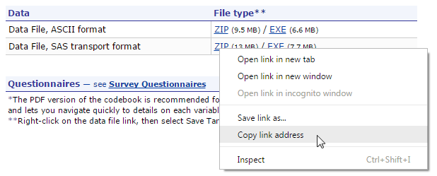

# Analyzing MEPS data using R

This repository is intended to provide example R code for those interested in analyzing data from the Agency for Healthcare Research and Quality's (AHRQ) Medical Expenditure Panel Survey (MEPS). 

The following codes are available:
* [loading_MEPS.R](loading_MEPS.R): example code to download MEPS files from [the MEPS website](https://meps.ahrq.gov/mepsweb/data_stats/download_data_files.jsp).
* [example1.R](example_1.R): code to re-create some of the estimates from the [MEPS summary table for 2013 data.](https://meps.ahrq.gov/mepsweb/data_stats/tables_compendia_hh_interactive.jsp?_SERVICE=MEPSSocket0&_PROGRAM=MEPSPGM.TC.SAS&File=HCFY2013&Table=HCFY2013_PLEXP_%40&VAR1=AGE&VAR2=SEX&VAR3=RACETH5C&VAR4=INSURCOV&VAR5=POVCAT13&VAR6=REGION&VAR7=HEALTH&VARO1=4+17+44+64&VARO2=1&VARO3=1&VARO4=1&VARO5=1&VARO6=1&VARO7=1&_Debug=).
* [example2.R](example_2.R): code to re-create the data and plot for Figure 1 in [Statistical brief \#491](https://meps.ahrq.gov/data_files/publications/st491/stat491.shtml).

> <b>Note to user</b>: AHRQ cannot guarantee the quality your analyses. It is the user's responsibility to verify that the intended estimates are accurate

## Survey package in R

The survey package should be used for all analyses involving MEPS data, in order to get appropriate standard errors. (MORE INFO ON SURVEY PACKAGE)

*   `svytotal`: population totals
*   `svymean`: proportions and means
*   `svyquantile`: quantiles (e.g. median)
*   `svyratio`: ratio statistics (e.g. percentage of total expenditures)
*   `svyglm`: generalized linear regression
*   `svyby`: run other survey functions by group


### Define survey design object

To use functions in the survey package, the `svydesign` function specifies the primary sampling unit, the strata, and the sampling weights for the data frame. The function also allows for nested designs.

``` r
mepsdsgn = svydesign(id = ~VARPSU, 
                     strata = ~VARSTR, 
                     weights = ~PERWT13F, 
                     data = h163, 
                     nest=TRUE)  
```

Then you can run examples such as:
```r
svymean(~TOTEXP13,design = mepsdsgn)  
```

Examples of using these surveyfunctions are available in Example1.R and Example2.R.


# Getting Started


## Loading Packages


To load MEPS data, we will use the foreign package, which allows R to read SAS transport files. The `install.packages` function only needs to be run once (to download the package from the internet and store it on your computer). Typically, this is done with the command `install.packages("foreign")`. The `library` function needs to be run every time you re-start your R session.

> Installing and Loading Packages: Packages are sets of R functions that are downloaded and installed into the R system. A library only needs to be installed once per R installation. However, the `library` function needs to be run every time you re-start your R session to load the package. Packages are tailor made to help perform certain statistical, graphical, or data tasks. Since R is used by many analysts, it is typical for only some packages to be loaded for each analysis 


``` r
 install.packages("foreign")  # Only need to run these once
 install.packages("survey")
 
 library(foreign) # Run these every time you re-start R
 library(survey)
```

## Loading MEPS data

We will need to load the data from the MEPS website into R. The data will be stored in a *data.frame* called `FYC2013`, since we are retrieving the 'Full Year Consolidated' file for the year 2013.


### Loading from a local directory

If you have manually downloaded and unzipped the MEPS data file to a local directory, you should save it to your local system. Here's an example where the files are stored at "C:\\MEPS\\SASDATA\\h163.ssp" on a Windows system:


<br>
The following code will load the data, using the foreign package function `read.xport`:

``` r
FYC2013 = read.xport("C:/MEPS/SASDATA/h163.ssp")
```
The object **FYC2013** is now loaded into R's memory as a data frame. 

> Warning! Be aware the directory names need to be separated by a slash ("/") or a double backslash ("\\\\"). This is because the single backslash is almost universally used as an string escape character in computing

### Load data directly from the MEPS website

Preferably, data downloading tasks can be automated using R. This offers several advantages when:

1. a large number of files need to be downloaded and,
2. another researcher needs to verify which files were downloaded (and from where),
3. data files might be updated periodically.

To do this, use the `download.file` function to save the zip file from MEPS website to the temporary file `temp`. Then use the `unzip` and `read.xport` functions to unzip and load the SAS transport data into R as a data frame.

``` r
download.file("https://meps.ahrq.gov/mepsweb/data_files/pufs/h163ssp.zip",
              temp <- tempfile())
unzipped_file = unzip(temp)
FYC2013 = read.xport(unzipped_file)
unlink(temp) # Unlink to delete temporary file
```

> To get the file location for a specific dataset, right-click on the ZIP link, then select 'Copy link address' to copy the location to your the clipboard.  
 

